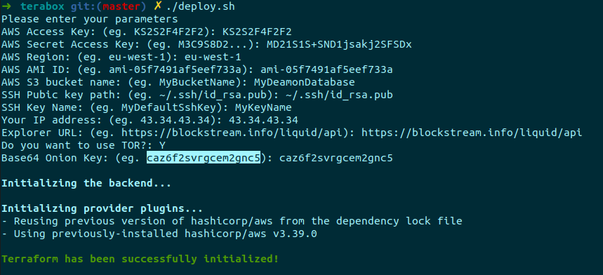

# tdex-box
Docker Compose for running TDex Daemon in production environments

 
## Configure

1. Clone this repository and enter in the folder

```sh
$ git clone https://github.com/TDex-network/tdex-box
$ cd tdex-box
```

2. Edit [feederd/config.json](https://github.com/TDex-network/tdex-feeder#config-file) file if you wish. By default it defines a market with LBTC-USDt and uses Kraken as price feed.


3. Export ENV variable for Esplora REST endpoint

```sh
# if left blank will default https://blockstream.info/liquid/api 
$ export EXPLORER=zzz
```

4. **OPTIONAL** TLS or Onion

#### TLS

Uncomment in the compose file (`docker-compose.yml`) the TLS related stuff and export ENV with the asbolute path to the SSL Certificate and Key to be used.

```sh
$ export SSL_CERT_PATH=/path/to/fullchain.pem
$ export SSL_KEY_PATH=/path/to/privatekey.pem
```

#### Onion

Add this compose service at the bottom of the compose file (either `docker-compose.yml`)

```yml
  # Tor Onion Hidden service
  tor:
    container_name: "tor"
    image: goldy/tor-hidden-service:latest
    restart: unless-stopped
    depends_on:
      - tdexd
    environment:
      # Set version 3 on TDEX
      TDEX_TOR_SERVICE_HOSTS: "80:tdexd:9945"
      TDEX_TOR_SERVICE_VERSION: "3"
      TDEX_TOR_SERVICE_KEY: ${ONION_KEY}
    # Keep keys in volumes
    volumes:
      - ./tor:/var/lib/tor/hidden_service/
```

Export your Onion service V3 private key or leave it blank to create a new one

```sh
$ export ONION_KEY=base64_Onion_V3_Private_Key
```

## Run 

```sh
$ docker-compose up -d
```

Check the Logs

```
$ docker logs tdexd --tail 20
$ docker logs feederd --tail 20
```


**Onion-only** Check the onion endpoint

```sh
$ docker exec tor onions
```

## **New** Auto-unlock

#### Unlocker

Starting from tdexd v0.5.0 and above, the image comes with a new `unlockerd` embedded binary useful to automatize the unlocking of the daemon's wallet once (re)started and initialized.

In the compose file you can find commented lines for enabling the unlocker with the `file` provider, which means it attempts to source the unlocking password from a local file.

Enabling the unlocker is as easy as creating a file containing the same password used to init your daemon's wallet and exporting its path in the `PWD_PATH` variable, like for example:

```bash
$ echo "mypassword" > pwd.txt
$ export PWD_PATH=$(pwd)/pwd.txt
```

Then, uncomment in the compose file the [command](docker-compose.yml#L34) and the [volume](docker-compose.yml#L42).

That's it. You just need to start up the container with the usual command:

```bash
$ docker-compose up -d tdexd
```

Or you can recreate it with:

```bash
$ docker-compose up -d --no-deps --force-recreate tdexd
```
#### Automatic Deployment to **AWS**
As part of automatic deployment we utilize terraform to deploy our services to the AWS EC2, with S3 backup. It is required from you to provide AWS keys, s3 bucket, region, ami id, SSH keys, Explorer URL, and your access IP.

For more information how to run it properly please checkout our blog post [here](https://dev.tdex.network/blog/tdex-terraform-deploy)
```bash
cd terabox && ./deploy.sh
```


